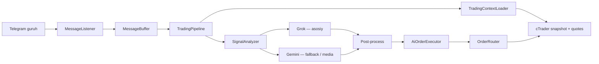

# cTrader Copy Trading Bot

> [English](README_EN.md)

Telegram guruh signallarini AI (Grok + Gemini) orqali tahlil qilib, **cTrader Open API** da avtomatik trade ochadigan Python bot.

```
Telegram xabar → Grok (asosiy) / Gemini (fallback) → JSON buyruq → cTrader trade
```

## Imkoniyatlar

- Telegram guruh(lar)dan matn, rasm, audio va video o‘qish
- **Grok** — asosiy AI tahlil (matn + rasm)
- **Gemini** — audio/video transkripsiya, fallback tahlil, zaxira modellar
- Har xabar uchun kontekst, mavjud orderlar/pozitsiyalar va bozor narxi (bid/ask)
- AI to‘liq qaror qiladi: symbol, side, orderType, narx, SL/TP, zone
- App faqat AI JSON ni bajaradi — strategiya AI da
- **Zone grid** — aggressive rejimda zone bo‘ylab limit/stop grid
- Har guruh uchun alohida **magic number** (chat ID dan)
- Order limitlari (guruh + global), `AGGRESSIVE_MODE`
- Pending orderlar uchun `ORDERS_EXPIRATION` (default 20 min)
- `TRADING_ENABLED=false` — dry-run (haqiqiy trade yo‘q)
- Graceful shutdown — inflight xabarlar tugaguncha kutadi

## Talablar

- Python 3.12+
- [Telegram API](https://my.telegram.org) — `API_ID`, `API_HASH`
- [Google AI Studio](https://aistudio.google.com/apikey) — Gemini API key
- [xAI API](https://console.x.ai) — Grok API key
- [cTrader Open API](https://openapi.ctrader.com) — OAuth token va account ID
- VPS yoki doimiy ishlaydigan server (Telegram session saqlanadi)

## O‘rnatish

```bash
git clone <repo-url>
cd cTrader

python -m venv venv

# Linux/macOS
source venv/bin/activate

# Windows
venv\Scripts\activate

pip install -r requirements.txt
```

## Sozlash

`.env.example` ni `.env` ga nusxalang va to‘ldiring:

```bash
cp .env.example .env
```

### `.env` o‘zgaruvchilari

| O‘zgaruvchi | Tavsif |
|---|---|
| `TELEGRAM_API_ID` | Telegram API ID |
| `TELEGRAM_API_HASH` | Telegram API hash |
| `TELEGRAM_SESSION_NAME` | Session fayl nomi (default: `tgtrading`) |
| `TELEGRAM_GROUP_IDS` | Guruh chat ID lar, vergul bilan (`-1001234567890`) |
| `GEMINI_API_KEY` | Google Gemini API key |
| `GEMINI_MODEL` | Asosiy Gemini model (media parse uchun) |
| `GEMINI_FALLBACK_MODELS` | Zaxira modellar, vergul bilan |
| `XAI_API_KEY` | xAI Grok API key |
| `XAI_MODEL` | Grok model (default: `grok-4.3`) |
| `CTRADER_CLIENT_ID` | cTrader Open API client ID |
| `CTRADER_CLIENT_SECRET` | cTrader client secret |
| `CTRADER_ACCESS_TOKEN` | OAuth access token |
| `CTRADER_REFRESH_TOKEN` | OAuth refresh token |
| `CTRADER_ACCOUNT_ID` | cTrader account ID (integer) |
| `CTRADER_HOST_TYPE` | `live` yoki `demo` |
| `CTRADER_REDIRECT_URI` | OAuth redirect URI |
| `TRADING_ENABLED` | `true` — live trade, `false` — dry-run |
| `ALLOWED_SYMBOLS` | Broker symbol nomlari, vergul bilan (`XAUUSDm,BTCUSDm`) |
| `DEFAULT_SYMBOL` | Default symbol (ixtiyoriy) |
| `DEFAULT_VOLUME` | Default lot (default: `0.01`) |
| `MIN_VOLUME` / `MAX_VOLUME` | Lot chegaralari |
| `MAX_ORDER_COUNT` | Global order limiti (default: `20`) |
| `MAX_ORDER_PER_GROUP` | Guruh order limiti (default: `5`) |
| `CONTEXT_MESSAGE_COUNT` | AI kontekst xabarlar soni (default: `5`) |
| `AGGRESSIVE_MODE` | `true` — zone grid + kattaroq volume |
| `ORDERS_EXPIRATION` | Pending order expire (minut, default: `20`) |

**Muhim:**

- `ALLOWED_SYMBOLS` brokerdagi **aniq** symbol nomi bo‘lishi kerak (masalan `XAUUSDm`, `BTCUSDm`).
- Guruh ID manfiy son: `-100...` formatida.
- Birinchi ishga tushirishda Telegram login kodi **Telegram ilovasiga** keladi (SMS emas).
- cTrader tokenlar muddati tugasa `CTRADER_ACCESS_TOKEN` / `CTRADER_REFRESH_TOKEN` ni yangilang.

## Ishga tushirish

```bash
python main.py
```

Logda ko‘rinadi:

- `DRY-RUN` — `TRADING_ENABLED=false`
- `LIVE` — `TRADING_ENABLED=true`
- `AGGRESSIVE` / `NORMAL` — rejim

To‘xtatish: `Ctrl+C`

## Ishlash oqimi



1. Telegram guruhdan yangi xabar keladi (matn/media).
2. Oxirgi N ta xabar kontekst sifatida beriladi.
3. cTrader dan mavjud orderlar/pozitsiyalar va bid/ask olinadi.
4. Audio/video → Gemini transkripsiya → Grok tahlil.
5. Grok xato bersa → Gemini fallback.
6. Post-process: symbol validatsiya, zone grid kengaytirish, SL/TP patch.
7. Order limit tekshiruvi → cTrader da bajarish.

## AI rejimlari

| Rejim | Xabar limiti | Zone strategiya |
|---|---|---|
| `NORMAL` | 2 entry/xabar | 1 market + 1 limit yoki 2 limit (zone chegaralarida) |
| `AGGRESSIVE` | 5 entry/xabar | 1 market + zone bo‘ylab grid limit/stop |

## Loyiha tuzilmasi

```
main.py                          # Entry point
pipeline/
  orchestrator.py                # Asosiy oqim (Telegram → AI → cTrader)
  shutdown_handler.py            # Graceful shutdown
telegram/
  client.py                      # Telethon servis
  listener.py                    # Guruh xabarlarini tinglash
  message_buffer.py              # Kontekst buferi
  media_extractor.py             # Media yuklash
ai/
  analyzer.py                    # Grok + Gemini tahlil
  grok_client.py                 # Asosiy AI (xAI API)
  gemini_client.py               # Fallback + media parse
  media_parser.py                # Audio/video → matn
  prompts.py                     # System prompt (TG_MSG_TEXT_TYPE qoidalari)
  zone_grid_expander.py          # Aggressive zone grid
  signal_post_processor.py       # Post-process qoidalari
trading/
  ai_order_executor.py           # AI JSON → cTrader operatsiyalar
  order_router.py                # market/limit/stop routing
  order_limit_tracker.py         # Guruh + global limit
  zone_order_planner.py          # Zone order rejalashtirish
  ctrader/
    service.py                   # cTrader servis (connect, snapshot)
    session.py                   # Protobuf sessiya
    trading_adapter.py           # Order CRUD (market/limit/stop/modify/close)
    auth.py                      # OAuth token refresh
    connection_keeper.py         # Ulanishni saqlash
config/
  settings.py                    # Pydantic settings (.env)
  group_magic.py                 # Guruh → magic number
  order_limits.py                # Normal/aggressive limitlar
models/                          # Pydantic modellar (AiTradeResponse, va h.k.)
```

## AI javob formati

Grok/Gemini quyidagi JSON qaytaradi:

```json
{
  "is_signal": true,
  "symbol": "XAUUSDm",
  "side": "buy",
  "zone_low": 2650.0,
  "zone_high": 2660.0,
  "orders": [
    {
      "countOrder": 1,
      "type": "entry",
      "price": 2655.0,
      "sl": 2645.0,
      "tp": 2670.0,
      "orderType": "limit",
      "volume": 0.01,
      "expirationMinutes": null
    }
  ],
  "reasoning": "..."
}
```

- `type`: `entry` | `modify` | `close` | `cancel`
- `orderType`: `market` | `limit` | `stop`
- Zone grid: har narx alohida `orders[]` elementi
- SL/TP faqat signalda aytilganda — aks holda `null`
- `expirationMinutes`: `null` → `ORDERS_EXPIRATION`, `0` → GTC

## Deploy (VPS)

### 1. Serverga yuklash

```bash
git clone <repo-url> /opt/ctrader-bot
cd /opt/ctrader-bot
python3 -m venv venv
source venv/bin/activate
pip install -r requirements.txt
cp .env.example .env
nano .env
```

Birinchi marta interaktiv login:

```bash
python main.py
# Telegram kodini kiriting — *.session fayl yaratiladi
```

Keyin `*.session` faylni saqlang — qayta login kerak bo‘lmasin.

### 2. systemd service (Linux)

`/etc/systemd/system/ctrader-bot.service`:

```ini
[Unit]
Description=cTrader Copy Trading Bot
After=network.target

[Service]
Type=simple
User=ubuntu
WorkingDirectory=/opt/ctrader-bot
Environment=PATH=/opt/ctrader-bot/venv/bin
ExecStart=/opt/ctrader-bot/venv/bin/python main.py
Restart=always
RestartSec=10

[Install]
WantedBy=multi-user.target
```

```bash
sudo systemctl daemon-reload
sudo systemctl enable ctrader-bot
sudo systemctl start ctrader-bot
sudo systemctl status ctrader-bot
journalctl -u ctrader-bot -f
```

## Xavfsizlik

- `.env` va session fayllarni hech qachon public repoga qo‘ymang
- Avval `TRADING_ENABLED=false` bilan sinab ko‘ring
- Live rejimga o‘tishdan oldin `ALLOWED_SYMBOLS` va volume limitlarini tekshiring
- cTrader OAuth tokenlarni muntazam yangilang

## Muammolar

| Muammo | Yechim |
|---|---|
| Telegram kod kelmaydi | Telegram ilovasini oching, SMS emas |
| `Invalid symbol` | `ALLOWED_SYMBOLS` ni brokerdagi nomga moslang |
| cTrader ulanish xatosi | Token muddati, `CTRADER_HOST_TYPE`, internet |
| Order ochilmadi | Logda `limit reached` — mavjud orderlar limitni to‘ldirgan |
| Grok xato | Avtomatik Gemini fallback — logda ko‘rinadi |
| `Unclosed client session` | Ctrl+C dan keyin bot to‘g‘ri yopiladi (`pipeline.stop()`) |

## Texnologiyalar

- **Python 3.12+**, asyncio, pydantic
- **Telethon** — Telegram client
- **ctrader-open-api** — cTrader Protobuf API
- **openai** (xAI base URL) — Grok structured output
- **google-genai** — Gemini fallback + media

## Litsenziya

Private / shaxsiy foydalanish.
