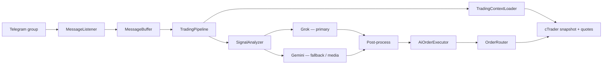

# cTrader Copy Trading Bot

> [O'zbekcha](README.md)

Python bot that analyzes Telegram group signals with AI (Grok + Gemini) and executes trades automatically via **cTrader Open API**.

```
Telegram message → Grok (primary) / Gemini (fallback) → JSON command → cTrader trade
```

## Features

- Read text, images, audio, and video from Telegram group(s)
- **Grok** — primary AI analysis (text + images)
- **Gemini** — audio/video transcription, fallback analysis, backup models
- Per-message context, existing orders/positions, and market prices (bid/ask)
- AI decides everything: symbol, side, orderType, price, SL/TP, zone
- App only executes AI JSON — strategy lives in AI
- **Zone grid** — limit/stop grid across a zone in aggressive mode
- Separate **magic number** per group (derived from chat ID)
- Order limits (per group + global), `AGGRESSIVE_MODE`
- `ORDERS_EXPIRATION` for pending orders (default 20 min)
- `TRADING_ENABLED=false` — dry-run (no real trades)
- Graceful shutdown — waits for in-flight messages

## Requirements

- Python 3.12+
- [Telegram API](https://my.telegram.org) — `API_ID`, `API_HASH`
- [Google AI Studio](https://aistudio.google.com/apikey) — Gemini API key
- [xAI API](https://console.x.ai) — Grok API key
- [cTrader Open API](https://openapi.ctrader.com) — OAuth token and account ID
- VPS or always-on server (Telegram session is persisted)

## Installation

```bash
git clone <repo-url>
cd cTrader

python -m venv venv

# Linux/macOS
source venv/bin/activate

# Windows
venv\Scripts\activate

pip install -r requirements.txt
```

## Configuration

Copy `.env.example` to `.env` and fill in values:

```bash
cp .env.example .env
```

### Environment variables

| Variable | Description |
|---|---|
| `TELEGRAM_API_ID` | Telegram API ID |
| `TELEGRAM_API_HASH` | Telegram API hash |
| `TELEGRAM_SESSION_NAME` | Session file name (default: `tgtrading`) |
| `TELEGRAM_GROUP_IDS` | Group chat IDs, comma-separated (`-1001234567890`) |
| `GEMINI_API_KEY` | Google Gemini API key |
| `GEMINI_MODEL` | Primary Gemini model (for media parsing) |
| `GEMINI_FALLBACK_MODELS` | Fallback models, comma-separated |
| `XAI_API_KEY` | xAI Grok API key |
| `XAI_MODEL` | Grok model (default: `grok-4.3`) |
| `CTRADER_CLIENT_ID` | cTrader Open API client ID |
| `CTRADER_CLIENT_SECRET` | cTrader client secret |
| `CTRADER_ACCESS_TOKEN` | OAuth access token |
| `CTRADER_REFRESH_TOKEN` | OAuth refresh token |
| `CTRADER_ACCOUNT_ID` | cTrader account ID (integer) |
| `CTRADER_HOST_TYPE` | `live` or `demo` |
| `CTRADER_REDIRECT_URI` | OAuth redirect URI |
| `TRADING_ENABLED` | `true` — live trading, `false` — dry-run |
| `ALLOWED_SYMBOLS` | Broker symbol names, comma-separated (`XAUUSDm,BTCUSDm`) |
| `DEFAULT_SYMBOL` | Default symbol (optional) |
| `DEFAULT_VOLUME` | Default lot size (default: `0.01`) |
| `MIN_VOLUME` / `MAX_VOLUME` | Lot size bounds |
| `MAX_ORDER_COUNT` | Global order limit (default: `20`) |
| `MAX_ORDER_PER_GROUP` | Per-group order limit (default: `5`) |
| `CONTEXT_MESSAGE_COUNT` | Number of context messages for AI (default: `5`) |
| `AGGRESSIVE_MODE` | `true` — zone grid + larger volume |
| `ORDERS_EXPIRATION` | Pending order expiry in minutes (default: `20`) |

**Important:**

- `ALLOWED_SYMBOLS` must match **exact** broker symbol names (e.g. `XAUUSDm`, `BTCUSDm`).
- Group IDs are negative: `-100...` format.
- On first run, the Telegram login code arrives in the **Telegram app** (not SMS).
- Refresh `CTRADER_ACCESS_TOKEN` / `CTRADER_REFRESH_TOKEN` when they expire.

## Running

```bash
python main.py
```

Logs show:

- `DRY-RUN` — `TRADING_ENABLED=false`
- `LIVE` — `TRADING_ENABLED=true`
- `AGGRESSIVE` / `NORMAL` — mode

Stop with `Ctrl+C`.

## Pipeline flow



1. New message arrives from a Telegram group (text/media).
2. Last N messages are provided as context.
3. Existing orders/positions and bid/ask are fetched from cTrader.
4. Audio/video → Gemini transcription → Grok analysis.
5. If Grok fails → Gemini fallback.
6. Post-process: symbol validation, zone grid expansion, SL/TP patch.
7. Order limit check → execute on cTrader.

## AI modes

| Mode | Per-message limit | Zone strategy |
|---|---|---|
| `NORMAL` | 2 entries/message | 1 market + 1 limit, or 2 limits at zone bounds |
| `AGGRESSIVE` | 5 entries/message | 1 market + grid of limit/stop orders across zone |

## Project structure

```
main.py                          # Entry point
pipeline/
  orchestrator.py                # Main flow (Telegram → AI → cTrader)
  shutdown_handler.py            # Graceful shutdown
telegram/
  client.py                      # Telethon service
  listener.py                    # Group message listener
  message_buffer.py              # Context buffer
  media_extractor.py             # Media download
ai/
  analyzer.py                    # Grok + Gemini analysis
  grok_client.py                 # Primary AI (xAI API)
  gemini_client.py               # Fallback + media parse
  media_parser.py                # Audio/video → text
  prompts.py                     # System prompt (TG_MSG_TEXT_TYPE rules)
  zone_grid_expander.py          # Aggressive zone grid
  signal_post_processor.py       # Post-process rules
trading/
  ai_order_executor.py           # AI JSON → cTrader operations
  order_router.py                # market/limit/stop routing
  order_limit_tracker.py         # Group + global limits
  zone_order_planner.py          # Zone order planning
  ctrader/
    service.py                   # cTrader service (connect, snapshot)
    session.py                   # Protobuf session
    trading_adapter.py           # Order CRUD (market/limit/stop/modify/close)
    auth.py                      # OAuth token refresh
    connection_keeper.py         # Connection keep-alive
config/
  settings.py                    # Pydantic settings (.env)
  group_magic.py                 # Group → magic number
  order_limits.py                # Normal/aggressive limits
models/                          # Pydantic models (AiTradeResponse, etc.)
```

## AI response format

Grok/Gemini return JSON like this:

```json
{
  "is_signal": true,
  "symbol": "XAUUSDm",
  "side": "buy",
  "zone_low": 2650.0,
  "zone_high": 2660.0,
  "orders": [
    {
      "countOrder": 1,
      "type": "entry",
      "price": 2655.0,
      "sl": 2645.0,
      "tp": 2670.0,
      "orderType": "limit",
      "volume": 0.01,
      "expirationMinutes": null
    }
  ],
  "reasoning": "..."
}
```

- `type`: `entry` | `modify` | `close` | `cancel`
- `orderType`: `market` | `limit` | `stop`
- Zone grid: each price is a separate `orders[]` element
- SL/TP only when mentioned in the signal — otherwise `null`
- `expirationMinutes`: `null` → `ORDERS_EXPIRATION`, `0` → GTC

## Deploy (VPS)

### 1. Upload to server

```bash
git clone <repo-url> /opt/ctrader-bot
cd /opt/ctrader-bot
python3 -m venv venv
source venv/bin/activate
pip install -r requirements.txt
cp .env.example .env
nano .env
```

First run (interactive login):

```bash
python main.py
# Enter Telegram code — creates *.session file
```

Keep the `*.session` file — you won't need to log in again.

### 2. systemd service (Linux)

`/etc/systemd/system/ctrader-bot.service`:

```ini
[Unit]
Description=cTrader Copy Trading Bot
After=network.target

[Service]
Type=simple
User=ubuntu
WorkingDirectory=/opt/ctrader-bot
Environment=PATH=/opt/ctrader-bot/venv/bin
ExecStart=/opt/ctrader-bot/venv/bin/python main.py
Restart=always
RestartSec=10

[Install]
WantedBy=multi-user.target
```

```bash
sudo systemctl daemon-reload
sudo systemctl enable ctrader-bot
sudo systemctl start ctrader-bot
sudo systemctl status ctrader-bot
journalctl -u ctrader-bot -f
```

## Security

- Never commit `.env` or session files to a public repo
- Test with `TRADING_ENABLED=false` first
- Verify `ALLOWED_SYMBOLS` and volume limits before going live
- Refresh cTrader OAuth tokens regularly

## Troubleshooting

| Issue | Fix |
|---|---|
| Telegram code not arriving | Open the Telegram app — not SMS |
| `Invalid symbol` | Match `ALLOWED_SYMBOLS` to broker symbol names |
| cTrader connection error | Check token expiry, `CTRADER_HOST_TYPE`, network |
| Order not placed | Log shows `limit reached` — existing orders hit the cap |
| Grok error | Automatic Gemini fallback — check logs |
| `Unclosed client session` | Bot shuts down cleanly on Ctrl+C (`pipeline.stop()`) |

## Stack

- **Python 3.12+**, asyncio, pydantic
- **Telethon** — Telegram client
- **ctrader-open-api** — cTrader Protobuf API
- **openai** (xAI base URL) — Grok structured output
- **google-genai** — Gemini fallback + media

## License

Private / personal use.
